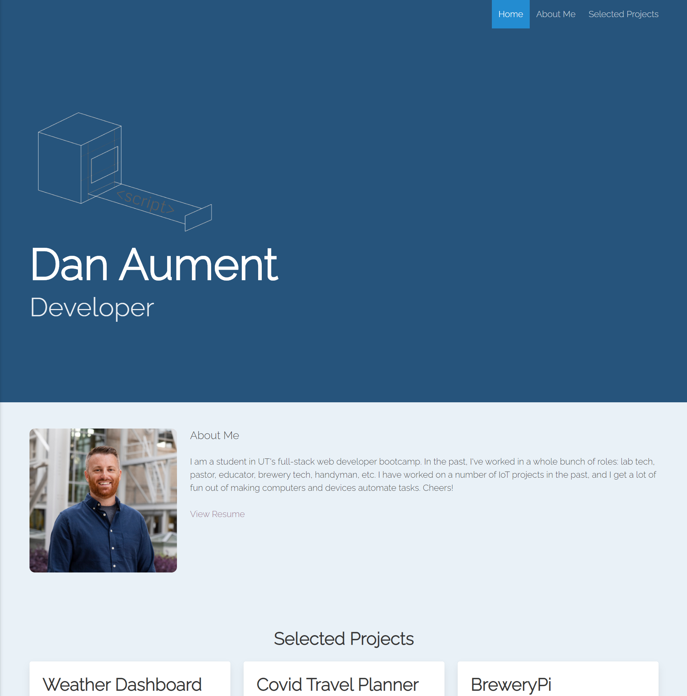

# Title: #Updated-Portfolio

## Table of Contents:
* [Description](#Description)
* [Screenshot](#Screenshot)
* [Location of Deployed Project](#Location)
* [Notes from Dan](#Notes)
* [Credits](#Credits)
* [License](#License)

### <a name="Description">Description:</a>
This project is a complete redesign of my portfolio as a homework assignment submission for the ninth week of UT's web dev coding bootcamp.  It contains a codebase and a deployed webpage for my portfolio to date.

### <a name="Screenshot">Screenshot: </a>

### <a name="Location">Location of Deployed Project:</a>
https://danaument.github.io/updated-portfolio/

### <a name="Notes">Notes from Dan:  </a>
A portfolio should reflect its owner, and I am fairly happy with how this page has turned out.  I used the Bulma CSS framework and challenged myself to learn and utilise SASS (compiled via live SASS VSCode extension).  I had some difficulty working with Bulma's SASS variables.  They seem to have recently restructured how they implement them, and the documentation is a bit thin.  

I look forward to continuing to update this portfolio with new selected projects, uniformly-sized images, a contact form, etc.

### <a name="Credits">Credits: </a>
This project was completed by Dan Aument using code and assets provided by The Coding Boot Camp at UT Austin in partnership with Trilogy Education Services.  I received direct help from my TA Brennan Predmoré.

### <a name="License">License: </a>

Distributed under the MIT License

MIT License

Copyright (c) 2020 Daniel Aument

Permission is hereby granted, free of charge, to any person obtaining a copy
of this software and associated documentation files (the "Software"), to deal
in the Software without restriction, including without limitation the rights
to use, copy, modify, merge, publish, distribute, sublicense, and/or sell
copies of the Software, and to permit persons to whom the Software is
furnished to do so, subject to the following conditions:

The above copyright notice and this permission notice shall be included in all
copies or substantial portions of the Software.

THE SOFTWARE IS PROVIDED "AS IS", WITHOUT WARRANTY OF ANY KIND, EXPRESS OR
IMPLIED, INCLUDING BUT NOT LIMITED TO THE WARRANTIES OF MERCHANTABILITY,
FITNESS FOR A PARTICULAR PURPOSE AND NONINFRINGEMENT. IN NO EVENT SHALL THE
AUTHORS OR COPYRIGHT HOLDERS BE LIABLE FOR ANY CLAIM, DAMAGES OR OTHER
LIABILITY, WHETHER IN AN ACTION OF CONTRACT, TORT OR OTHERWISE, ARISING FROM,
OUT OF OR IN CONNECTION WITH THE SOFTWARE OR THE USE OR OTHER DEALINGS IN THE
SOFTWARE.